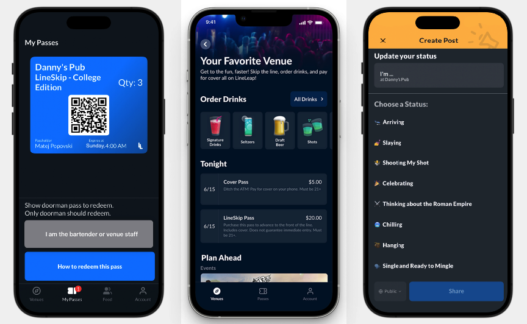

## LineLeap2

Lineleap2 is an experimental Swift and SwiftUI-based iOS app developed in Xcode. The app mimics the concept of bypassing lines at bars, clubs, or events—but with a twist. The project was built solely for experimental purposes, aiming to explore user interface transitions, button actions, and screen navigation in SwiftUI.

⚠️ Disclaimer: This project was created for educational purposes only. Any attempts to skip lines at real-life venues without permission are discouraged. Lineleap2 is a proof of concept to demonstrate iOS app development using Swift and SwiftUI.

### Features
SwiftUI Interface: The app employs a modern SwiftUI framework to create clean and elegant user interfaces.
Button Action & Screen Transition: A button triggers an action that smoothly transitions to a new screen, demonstrating UI navigation.
Custom UI Design: Experimented with customized styling for buttons and transitions to give the app a unique and polished look.

### Tech Stack
Language: Swift
Framework: SwiftUI
Development Environment: Xcode

